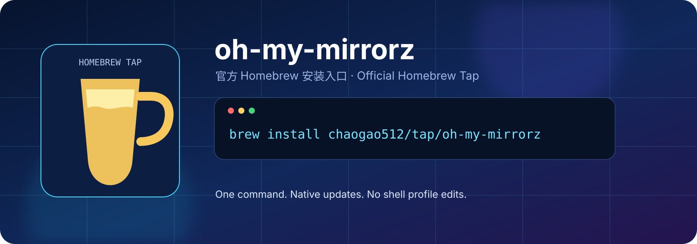

<p align="center">
  
</p>

<h1 align="center">Homebrew Tap for oh-my-mirrorz</h1>

<p align="center">
  <strong>一个命令完成安装，后续更新交给 Homebrew。</strong><br>
  面向 macOS 与 Linux 的 <a href="https://github.com/chaogao512/oh-my-mirrorz">oh-my-mirrorz</a> 官方 Tap。
</p>

<p align="center">
  <a href="https://github.com/chaogao512/homebrew-tap/actions/workflows/tests.yml"></a>
  <a href="https://github.com/chaogao512/oh-my-mirrorz/releases/latest"></a>
  <a href="LICENSE"></a>
</p>

<p align="center">
  简体中文 · <a href="README.en.md">English</a>
</p>

## 安装

```bash
brew install chaogao512/tap/oh-my-mirrorz
```

安装完成后即可直接使用，无需修改 `.zshrc`，也无需手动移动二进制文件：

```bash
omm version
omm scan
omm switch --dry-run
```

Homebrew 会自动添加 `chaogao512/tap`，并将 `omm` 放入 Homebrew 已管理的可执行路径。这里采用的是 Homebrew 官方推荐的 Tap 直接安装方式。

## 日常管理

| 目标 | 命令 |
| --- | --- |
| 安装 | `brew install chaogao512/tap/oh-my-mirrorz` |
| 更新 Homebrew 元数据 | `brew update` |
| 升级 oh-my-mirrorz | `brew upgrade oh-my-mirrorz` |
| 查看版本 | `omm version` |
| 卸载 | `brew uninstall oh-my-mirrorz` |
| 移除 Tap（可选） | `brew untap chaogao512/tap` |

## 这个 Tap 做了什么

- 从不可变的 Git 标签下载 `oh-my-mirrorz` 源码，并校验 SHA-256。
- 使用 Homebrew 提供的 Go 构建依赖在本机编译 `omm`。
- 通过 Formula 测试验证版本输出和镜像目录读取。
- 通过 GitHub Actions 检查 Formula 样式、审计结果、源码构建与安装链路。

当前 Formula：

| 软件 | Formula | 当前版本 | 上游 |
| --- | --- | --- | --- |
| oh-my-mirrorz | [`Formula/oh-my-mirrorz.rb`](Formula/oh-my-mirrorz.rb) | `v0.1.1` | [项目仓库](https://github.com/chaogao512/oh-my-mirrorz) |

## 验证安装

```bash
brew info chaogao512/tap/oh-my-mirrorz
brew test chaogao512/tap/oh-my-mirrorz
omm doctor
```

`omm doctor` 会检查本机配置状态；它不会因为通过 Homebrew 安装而自动修改任何镜像源。

## 问题反馈

| 问题类型 | 提交位置 |
| --- | --- |
| Formula 无法下载、构建或安装 | [本仓库 Issues](https://github.com/chaogao512/homebrew-tap/issues) |
| 换源行为、适配器、恢复或安全问题 | [oh-my-mirrorz Issues](https://github.com/chaogao512/oh-my-mirrorz/issues) |

## 许可证

本 Tap 采用 [MIT License](LICENSE)。`oh-my-mirrorz` 的源码与许可见其[上游仓库](https://github.com/chaogao512/oh-my-mirrorz)。
